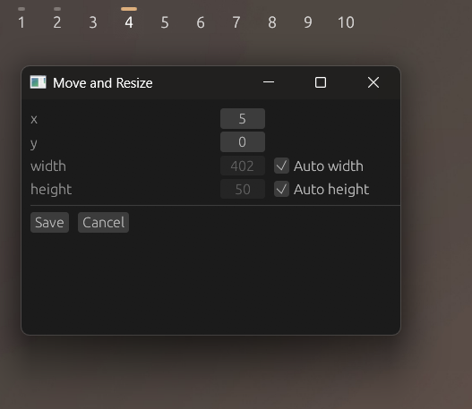

<p align="center"></p>

# komorebi-switcher

A minimal workspace switcher for the [Komorebi](https://github.com/LGUG2Z/komorebi/) tiling window manager, seamlessly integrated the Windows 10/11 taskbar.


## Install

<a href="https://github.com/amrbashir/komorebi-switcher/releases/latest">
  <picture>
    
  </picture>
</a>

Or through PowerShell:

```powershell
irm "https://github.com/amrbashir/komorebi-switcher/releases/latest/download/komorebi-switcher-setup.exe" -OutFile "komorebi-switcher-setup.exe"
& "./komorebi-switcher-setup.exe"
```

## Usage

- <kbd>Left Click</kbd> any workspace to switch to it.
- <kbd>Right Click</kbd> to open the context menu:

  - **Move & Resize**: Open the move and resize dialog.

    

  - **Quit**: close the switcher

> [!TIP]
> You can also open the context menu from the tray icon.

## Development

1. Install [Rust](https://rustup.rs/)
2. Run `cargo run`

## LICENSE

[MIT](./LICENSE) License
